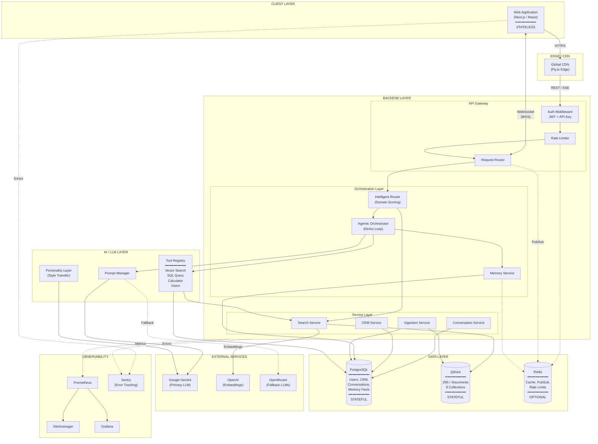
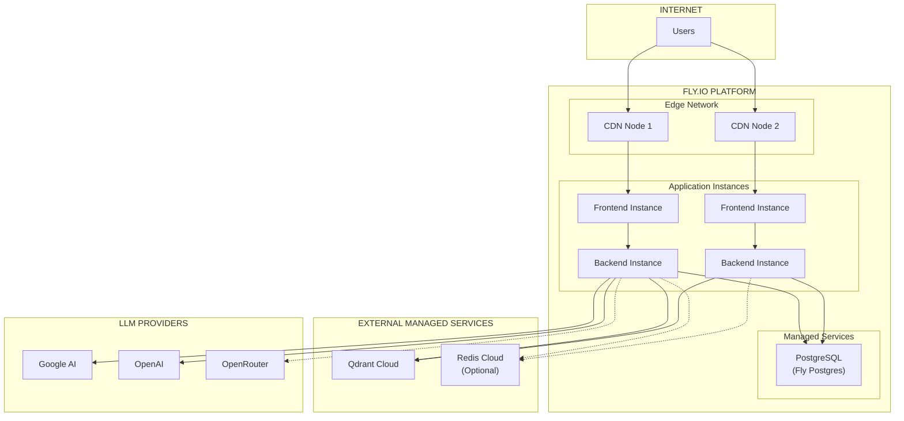
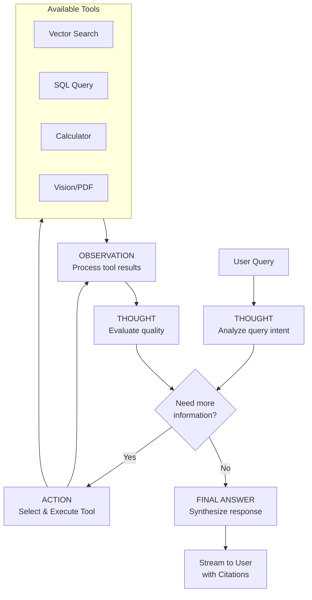
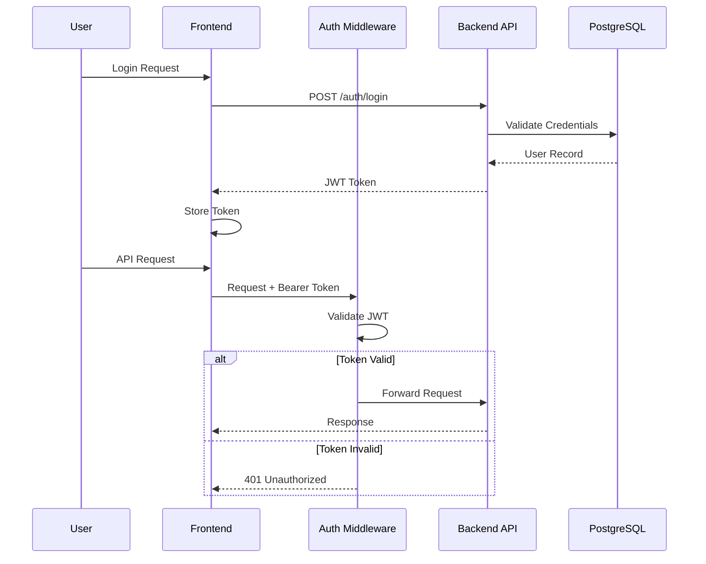
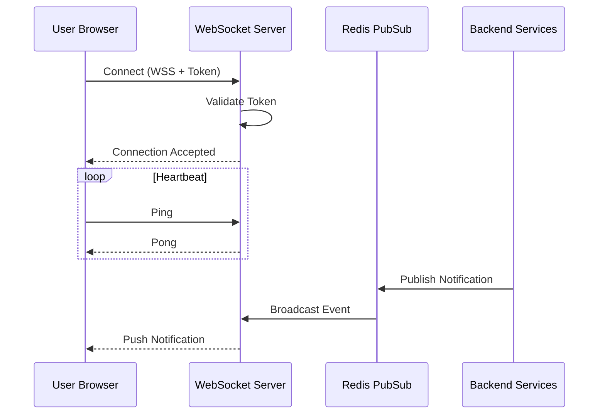

# NUZANTARA — Architecture Diagrams

## 1. System Overview

---

## 2. Request Data Flow

```mermaid
flowchart LR
    subgraph REQUEST["REQUEST FLOW"]
        direction TB
        Q["User Query"]
        Q --> V["Validate & Auth"]
        V --> R["Route by Domain"]
        R --> E["Generate Embedding"]
        E --> S["Semantic Search"]
        S --> C["Build Context"]
        C --> L["LLM Generation"]
        L --> P["Apply Personality"]
        P --> A["Stream Response"]
    end

    subgraph STORAGE["STATE CHANGES"]
        direction TB
        S1["Save Message"]
        S2["Extract Memory Facts"]
        S3["Update CRM"]
        S4["Log Audit Trail"]
    end

    A --> S1
    S1 --> S2
    S2 --> S3
    S3 --> S4
```

---

## 3. Deployment Topology

---

## 4. Agentic RAG Flow (ReAct Pattern)

---

## 5. Authentication Flow

---

## 6. WebSocket Real-Time Flow

---

## Component Legend

| Symbol | Meaning |
|--------|---------|
| `──▶` | Synchronous request |
| `-.->` | Optional / Async |
| `(Database)` | Stateful storage |
| `[Service]` | Stateless component |
| `STATELESS` | Can scale horizontally |
| `STATEFUL` | Requires persistence |
| `OPTIONAL` | System works without it |

---

## How to View

1. **VS Code**: Install "Markdown Preview Mermaid Support" extension, then preview this file
2. **Online**: Use Mermaid Live Editor or compatible viewer
3. **Mermaid Live**: Copy diagrams to [mermaid.live](https://mermaid.live)
4. **Export**: Use Mermaid CLI to export as PNG/SVG
